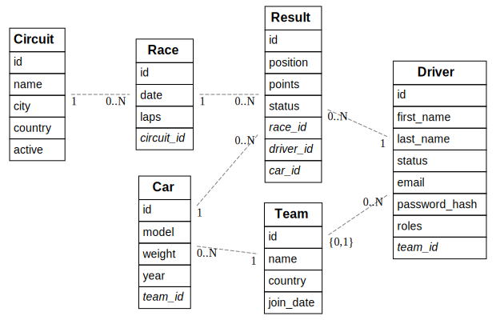

# Dossier

> Duid aan welke vakken je volgt en vermeld voor deze vakken de link naar jouw GitHub repository. In het geval je slechts één vak volgt, verwijder alle inhoud omtrent het andere vak uit dit document.
> Lees <https://github.com/adam-p/markdown-here/wiki/Markdown-Cheatsheet> om te weten hoe een Markdown-bestand opgemaakt moet worden.
> Verwijder alle instructies (lijnen die starten met >).

- Student: Silas De Vuyst
- Studentennummer: 202399688
- E-mailadres: <mailto:silas.devuyst@student.hogent.be>
- Demo: <DEMO_LINK_HIER>
- GitHub-repository: <https://github.com/HOGENT-frontendweb/frontendweb-2425-SDeVuyst>
- Web Services:
  - Online versie: <LINK_ONLINE_VERSIE_HIER>

## Logingegevens

### Lokaal

- Gebruikersnaam/e-mailadres:
- Wachtwoord:

### Online

- Gebruikersnaam/e-mailadres:
- Wachtwoord:

> Vul eventueel aan met extra accounts voor administrators of andere rollen.

## Projectbeschrijving

> Omschrijf hier duidelijk waarover jouw project gaat. Voeg een domeinmodel (of EERD) toe om jouw entiteiten te verduidelijken.
>
Driver wordt als user gezien.




## API calls

### Driver
- `GET /api/drivers`: alle drivers ophalen (auth en admin vereist)
- `GET /api/drivers/:id`: driver met een bepaald id ophalen (auth vereist)
- `GET /api/drivers/:id/results`: De resultaten van een driver met een bepaald id ophalen (auth vereist)
- `POST /api/drivers`: een nieuwe driver aanmaken (auth vereist)
- `PUT /api/drivers/:id`: een driver aanpassen (auth vereist)
- `DELETE /api/drivers/:id`: een driver met een bepaald id verwijderen (auth vereist)

### Circuit
- `GET /api/circuits`: alle circuits ophalen (geen vereisten)
- `GET /api/circuits/:id`: circuit met een bepaald id ophalen (geen vereisten)
- `GET /api/circuits/:id/races`: races op een circuit met een bepaald id ophalen (geen vereisten)
- `POST /api/circuits`: een nieuw circuit aanmaken (auth en admin vereist)
- `PUT /api/circuits/:id`: een circuit aanpassen (auth en admin vereist)
- `DELETE /api/circuits/:id`: een circuit met een bepaald id verwijderen (auth en admin vereist)

### Race
- `GET /api/races`: alle races ophalen (geen vereisten)
- `GET /api/races/:id`: races met een bepaald id ophalen (auth vereisten)
- `GET /api/races/:id/results`: De resultaten van een race met een bepaald id ophalen (auth vereisten)
- `POST /api/races`: een nieuwe race aanmaken (auth en admin vereist)
- `PUT /api/races/:id`: een race aanpassen (auth en admin vereist)
- `DELETE /api/races/:id`: een race met een bepaald id verwijderen (auth en admin vereist)
  
### Result
- `GET /api/results`: alle results ophalen (auth vereisten)
- `GET /api/results/:id`: result met een bepaald id ophalen (auth vereisten)
- `POST /api/results`: een nieuwe result aanmaken (admin vereist)
- `PUT /api/results/:id`: een result aanpassen (admin vereist)
- `DELETE /api/results/:id`: een result met een bepaald id verwijderen (admin vereist)

### Team
# todo

### Car
# TODO 
  
## Behaalde minimumvereisten

> Duid per vak aan welke minimumvereisten je denkt behaald te hebben

### Web Services

#### Datalaag

- [ ] voldoende complex en correct (meer dan één tabel (naast de user tabel), tabellen bevatten meerdere kolommen, 2 een-op-veel of veel-op-veel relaties)
- [ ] één module beheert de connectie + connectie wordt gesloten bij sluiten server
- [ ] heeft migraties - indien van toepassing
- [ ] heeft seeds

#### Repositorylaag

- [ ] definieert één repository per entiteit - indien van toepassing
- [ ] mapt OO-rijke data naar relationele tabellen en vice versa - indien van toepassing
- [ ] er worden kindrelaties opgevraagd (m.b.v. JOINs) - indien van toepassing

#### Servicelaag met een zekere complexiteit

- [ ] bevat alle domeinlogica
- [ ] er wordt gerelateerde data uit meerdere tabellen opgevraagd
- [ ] bevat geen services voor entiteiten die geen zin hebben zonder hun ouder (bv. tussentabellen)
- [ ] bevat geen SQL-queries of databank-gerelateerde code

#### REST-laag

- [ ] meerdere routes met invoervalidatie
- [ ] meerdere entiteiten met alle CRUD-operaties
- [ ] degelijke foutboodschappen
- [ ] volgt de conventies van een RESTful API
- [ ] bevat geen domeinlogica
- [ ] geen API calls voor entiteiten die geen zin hebben zonder hun ouder (bv. tussentabellen)
- [ ] degelijke autorisatie/authenticatie op alle routes

#### Algemeen

- [ ] er is een minimum aan logging en configuratie voorzien
- [ ] een aantal niet-triviale én werkende integratietesten (min. 1 entiteit in REST-laag >= 90% coverage, naast de user testen)
- [ ] node_modules, .env, productiecredentials... werden niet gepushed op GitHub
- [ ] minstens één extra technologie die we niet gezien hebben in de les
- [ ] maakt gebruik van de laatste ES-features (async/await, object destructuring, spread operator...)
- [ ] de applicatie start zonder problemen op gebruikmakend van de instructies in de README
- [ ] de API draait online
- [ ] duidelijke en volledige README.md
- [ ] er werden voldoende (kleine) commits gemaakt
- [ ] volledig en tijdig ingediend dossier

## Projectstructuur

### Web Services

> Hoe heb je jouw applicatie gestructureerd (mappen, design patterns...)?

## Extra technologie

1) zxcvbn wordt gebruikt als validator bovenop Joi om de sterkte van wachtwoorden te valideren.

### Web Services

Ik heb gekozen om [apiDoc](https://www.npmjs.com/package/apidoc) te gebruiken in plaats van Swagger. Met apiDoc kan je makkelijk een documentatie pagina genereren via:
```shell
npx apidoc -i src/ -o docs/
```
Aangezien ik dit veel moest uitvoeren heb ik hiervan een script gemaakt in package.json, nu kan er nog gemakkelijker documentatie worden aangemaakt via:
```shell
yarn docs
```
De documentatie van de API routes worden beschreven in de rest-laag, door middel van specifieke comments. De documentatie bekijken kan via [/docs/index.html](docs/index.html)


## Gekende bugs

### Web Services

> Zijn er gekende bugs?

## Reflectie

> Wat vond je van dit project? Wat heb je geleerd? Wat zou je anders doen? Wat vond je goed? Wat vond je minder goed?
> Wat zou je aanpassen aan de cursus? Wat zou je behouden? Wat zou je toevoegen?
